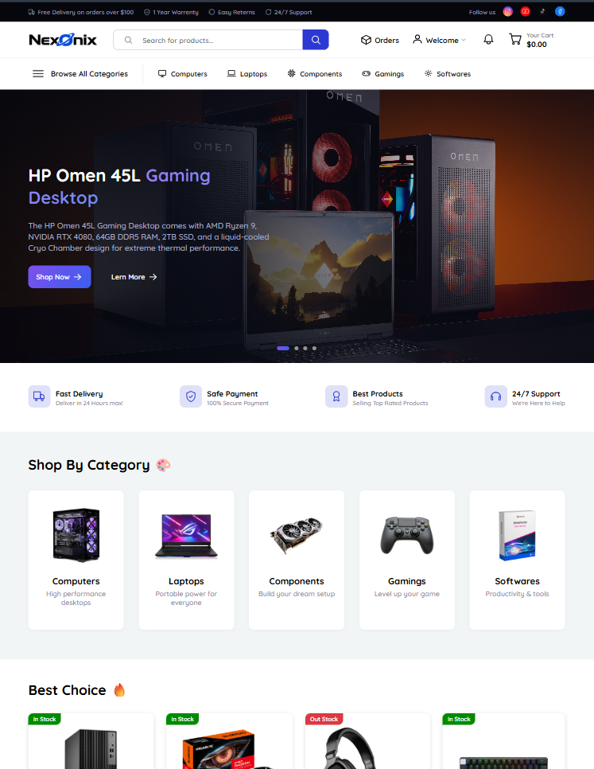
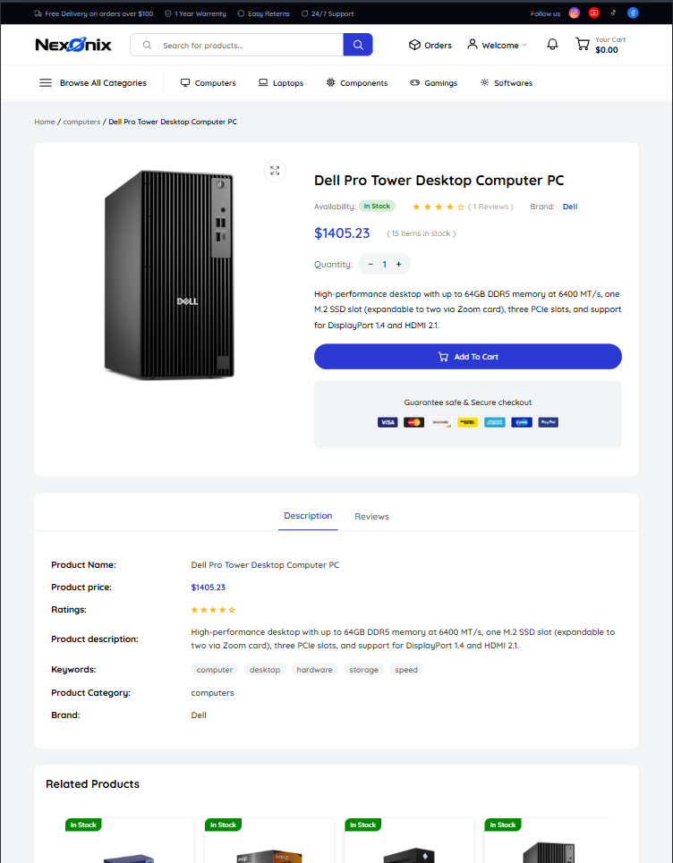
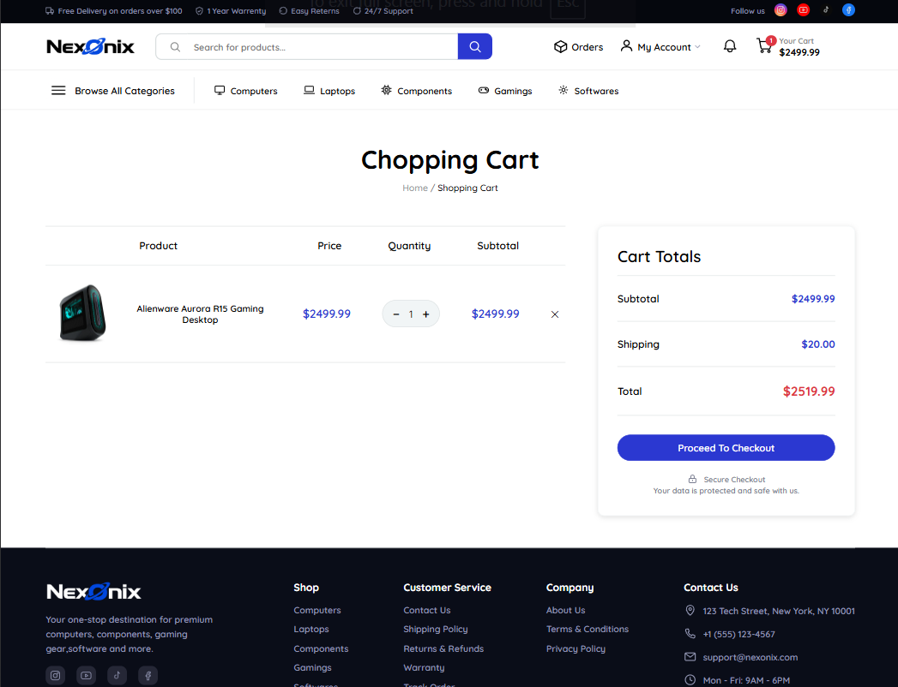
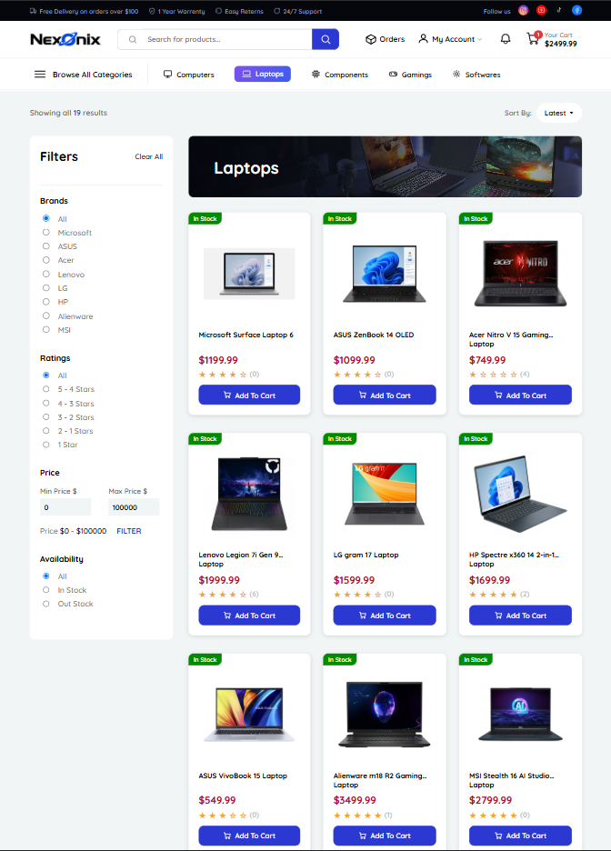
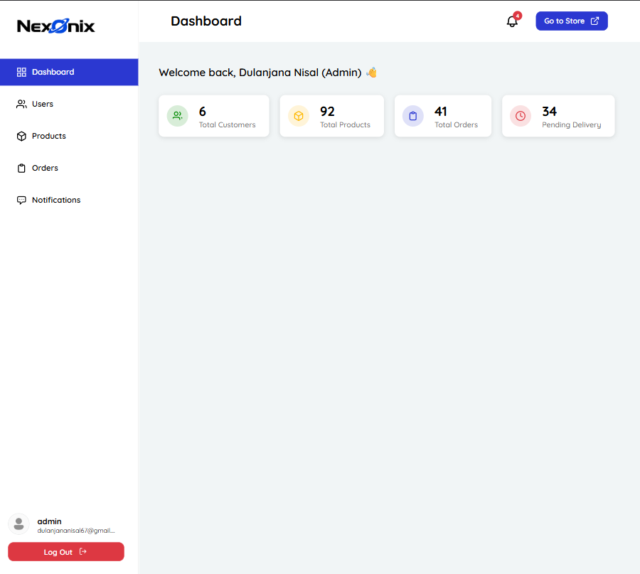
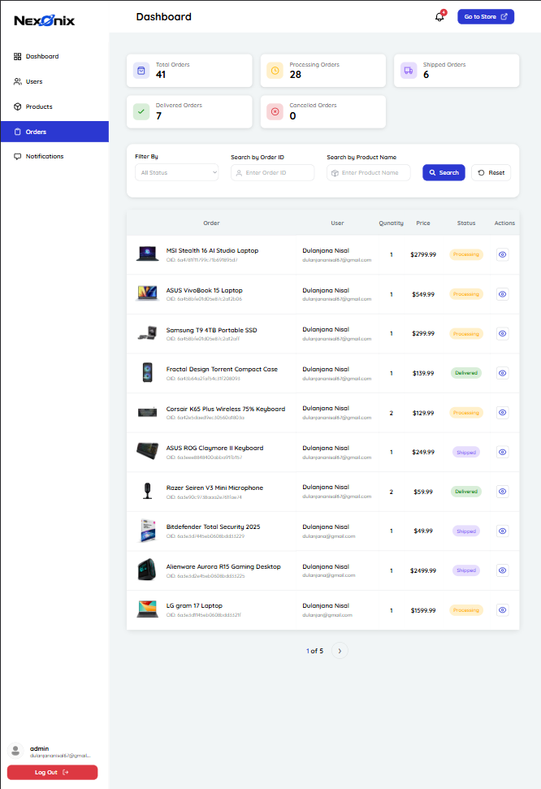
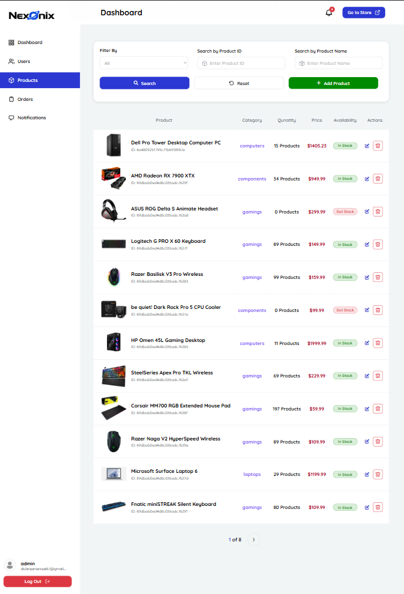
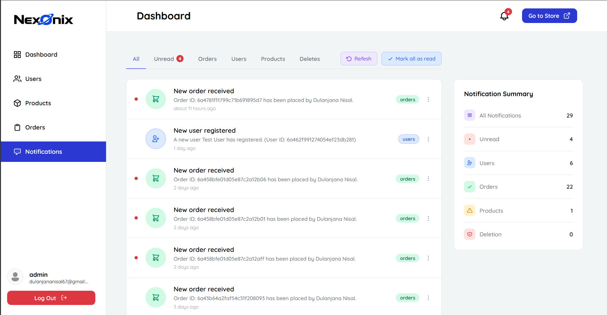
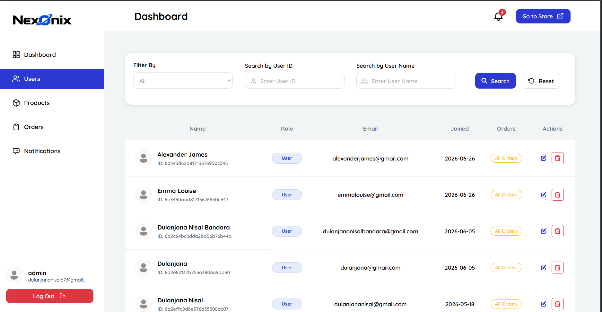

<div align="center">


# Nexonix

**A full-stack MERN e-commerce platform with a customer storefront and admin dashboard**

[](https://react.dev)
[](https://nodejs.org)
[](https://www.mongodb.com)
[](https://vitejs.dev)
[](#license)

[Features](#-features) • [Tech Stack](#-tech-stack) • [Screenshots](#-screenshots) • [Getting Started](#-getting-started) • [Project Structure](#-project-structure) • [API Overview](#-api-overview)

</div>

---

## 📖 About

**Nexonix** is a full-stack e-commerce platform built on the MERN stack (MongoDB, Express, React, Node.js), featuring a customer-facing storefront and a dedicated admin dashboard. It covers the core workflows of a real online store: browsing and searching products, cart management, checkout and order tracking, product reviews, user notifications, and admin-side inventory/order management.

This project was built as a hands-on deep dive into full-stack architecture — authentication flows, REST API design, state management, and building a cohesive design system across two separate applications sharing one backend.

## ✨ Features

**Storefront**
- Product browsing with category filters, search, and sorting
- Product detail pages with image galleries and customer reviews
- Users can write, edit, and delete their own product reviews and star ratings
- Shopping cart with quantity management
- User accounts — signup, login, profile management
- Order placement and order history
- Real-time-style notifications (order updates, promotions)

**Admin Dashboard**
- Sales and inventory overview dashboard
- Product management (create, edit, delete, stock tracking)
- Order management and status updates
- User management
- Notification broadcast tools

**Platform-wide**
- JWT-based authentication with role-based access (customer / admin)
- Custom empty-state illustrations and a consistent design system across both apps
- Responsive layouts for storefront and dashboard

## 🛠 Tech Stack

| Layer | Technology |
|---|---|
| **Frontend** | React 19, React Router 7, Vite, Axios |
| **Backend** | Node.js, Express 5 |
| **Database** | MongoDB with Mongoose ODM |
| **Auth** | JSON Web Tokens (JWT), bcrypt |
| **Tooling** | ESLint, Nodemon |

## 📸 Screenshots

> _Add screenshots of the storefront and admin dashboard here — drop image files into `docs/screenshots/` and reference them below._

<div align="center">

| Storefront — Home | Product Details | Cart |
|---|---|---|
|  |  |  |

| Product List (Category) | Admin — Dashboard | Order Management |
|---|---|---|
|  |  |  |

| Product Management | Notification Management | User Management |
|---|---|---|
|  |  |  |

</div>

## 🚀 Getting Started

### Prerequisites
- Node.js v18+
- A MongoDB instance (local or [MongoDB Atlas](https://www.mongodb.com/atlas))

### 1. Clone the repository
```bash
git clone https://github.com/<your-username>/nexonix.git
cd nexonix
```

### 2. Backend setup
```bash
cd backend
npm install
```

Create a `.env` file in `backend/`:
```env
PORT=5000
MONGO_URI=your_mongodb_connection_string
JWT_SECRET=your_jwt_secret
ADMIN_EMAIL=your_admin_email
```

Run the backend:
```bash
npm run dev
```

### 3. Frontend setup
```bash
cd frontend/ecommerce-store
npm install
npm run dev
```

The storefront will be available at `http://localhost:5173` and the API at `http://localhost:5000`.

## 📁 Project Structure

```
nexonix/
├── backend/
│   ├── src/
│   │   ├── app.js                       # Express app entry point
│   │   ├── db/
│   │   │   └── server.js                # MongoDB connection & server bootstrap
│   │   ├── controllers/                 # Route handlers / business logic
│   │   │   ├── accountsController.js    # Signup / login
│   │   │   ├── userController.js        # User CRUD (admin)
│   │   │   ├── productsController.js    # Product catalog CRUD
│   │   │   ├── cartController.js        # Cart item management
│   │   │   ├── ordersController.js      # Order placement & tracking
│   │   │   ├── reviewController.js      # Product reviews
│   │   │   └── notificationController.js
│   │   ├── models/                      # Mongoose schemas
│   │   │   ├── usersModule.js
│   │   │   ├── productsModel.js
│   │   │   ├── cartModel.js
│   │   │   ├── ordersModel.js
│   │   │   ├── reviewsModel.js
│   │   │   └── notificationModel.js
│   │   ├── routers/                     # Express route definitions
│   │   │   ├── AccountsRouters.js
│   │   │   ├── usersRouter.js
│   │   │   ├── productsRouters.js
│   │   │   ├── cartRouters.js
│   │   │   ├── ordersRouters.js
│   │   │   ├── reviewRouter.js
│   │   │   └── notificationRouters.js
│   │   ├── middlewares/
│   │   │   ├── authenticationMiddleware.js
│   │   │   ├── verifyAdminMiddleware.js
│   │   │   ├── errorHandlerMiddleware.js
│   │   │   └── notFoundMiddleware.js
│   │   ├── errors/                      # Custom error classes
│   │   │   ├── BadRequestError.js
│   │   │   ├── CustomError.js
│   │   │   ├── NotFoundError.js
│   │   │   └── UnauthorizedError.js
│   │   ├── scripts/
│   │   │   └── createAdmin.js           # CLI script to seed an admin user
│   │   └── utils/
│   │       └── asyncHandler.js
│   └── package.json
│
└── frontend/
    └── ecommerce-store/
        ├── src/
        │   ├── main.jsx                 # App entry point
        │   ├── App.jsx                  # Route definitions (storefront + admin)
        │   ├── Admin/                    # Admin dashboard app
        │   │   ├── pages/
        │   │   │   ├── Dashboard/       # Sales & inventory overview
        │   │   │   ├── Products/        # Product management
        │   │   │   ├── Orders/          # Order management
        │   │   │   ├── Users/           # User management
        │   │   │   └── Notifications/   # Notification broadcast tools
        │   │   ├── Components/
        │   │   └── Context/             # Admin-side state/context
        │   ├── pages/                    # Storefront route pages
        │   │   ├── Home/
        │   │   ├── Category/
        │   │   ├── Details/              # Product detail + reviews
        │   │   ├── Search/
        │   │   ├── Cart/
        │   │   ├── Checkout/
        │   │   ├── Orders/
        │   │   ├── Notifications/
        │   │   ├── Account/               # Login / signup / profile
        │   │   └── 404/
        │   ├── components/                # Shared reusable UI
        │   │   ├── Header/
        │   │   ├── Footer/
        │   │   ├── Product/
        │   │   ├── Messages/
        │   │   └── Loading/
        │   ├── context/                   # Cart/auth state (React Context)
        │   ├── services/                  # Axios API client
        │   ├── api/                       # API request definitions
        │   ├── utils/                     # Helpers
        │   └── assets/                    # Images, icons, illustrations
        └── package.json
```

## 🔌 API Overview

| Resource | Base Route | Description |
|---|---|---|
| Auth | `/api/v1/account` | Signup, login |
| Users | `/api/v1/users` | User CRUD (admin) |
| Products | `/api/v1/products` | Product catalog CRUD |
| Cart | `/api/v1/cart` | Cart management |
| Orders | `/api/v1/orders` | Order placement & tracking |
| Reviews | `/api/v1/reviews` | Product reviews |
| Notifications | `/api/v1/notifications` | User notifications |

## 🗺 Roadmap

- [ ] Payment gateway integration (Stripe/PayPal)
- [ ] Product wishlist
- [ ] Email notifications
- [ ] Order analytics for admin dashboard

## 🤝 Contributing

Contributions, issues, and feature requests are welcome. Feel free to check the [issues page](../../issues) if you'd like to contribute.

## 📄 License

This project is licensed under the MIT License — see the [LICENSE](LICENSE) file for details.

## 👤 Author

**Dulanjana**
Full-stack developer, focused on the MERN stack and AI engineering.

---

<div align="center">
<sub>Built with React, Node.js, Express, and MongoDB.</sub>
</div>
